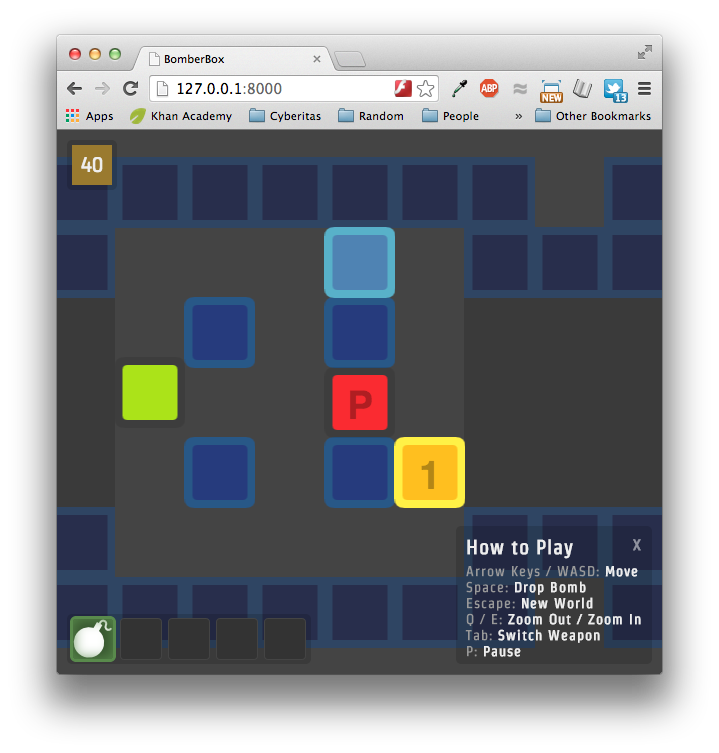

BomberBox
=========

A simple multiplayer web game, using sockets and canvas. Players run through a dungeon, containing a mixture of horrifically annoying to laughably easy enemies. This game is far from finished.

Playing
=========

BomberBox is server-based. To start a server, run this command:

    node bomberboxserver.js --host [your ip address]

Start playing by opening a browser and going to the entered IP address on port **8000**.

The game server runs on port **6114**.
