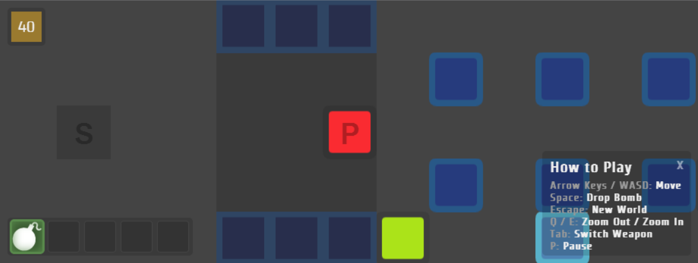

BomberBox
=========

A simple multiplayer web game, using sockets and canvas. Players run through a dungeon and attack laughably easy enemies.



Setting up
=========

Checkout the project with
```
git clone https://github.com/leebradley/BomberBox.git
```

Install with `yarn`

Run the game server with `yarn run start`

Open Chrome and visit `http://localhost:8080/`

Developing
=========

I recommend *Atom* with the following packages:
* https://atom.io/packages/linter-eslint
* https://atom.io/packages/react

Playing
=========

BomberBox is server-based. To start a server, run this command:

    node bomberboxserver.js --host [your ip address]

Start playing by opening a browser and going to the entered IP address on port **8000**.

The game server runs on port **6114**.

License
=========

This project is licensed under the standard MIT license. See the [LICENSE](LICENSE) file.
